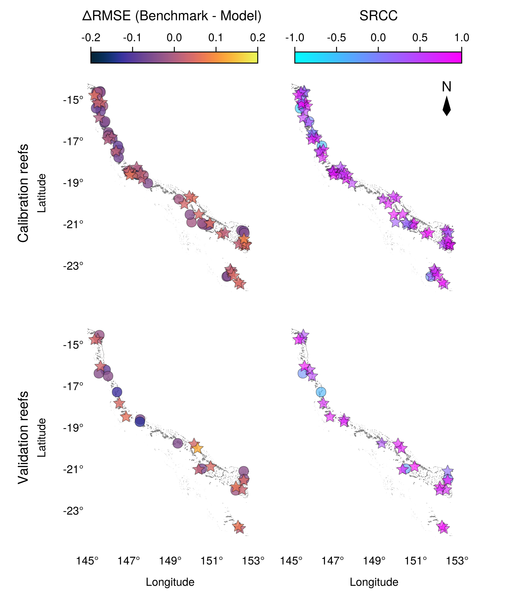

# Introduction

TODO: migrate from Word draft.

# Methods

TODO: migrate from Word draft.

# Results

TODO: migrate from Word draft. Reference generated figures directly, e.g.:

<!--
{#fig-performance fig-align="center" width="14.8cm"}
-->

# Discussion

TODO: migrate from Word draft.

# Conclusion

TODO: migrate from Word draft.

# Acknowledgements

TODO.
